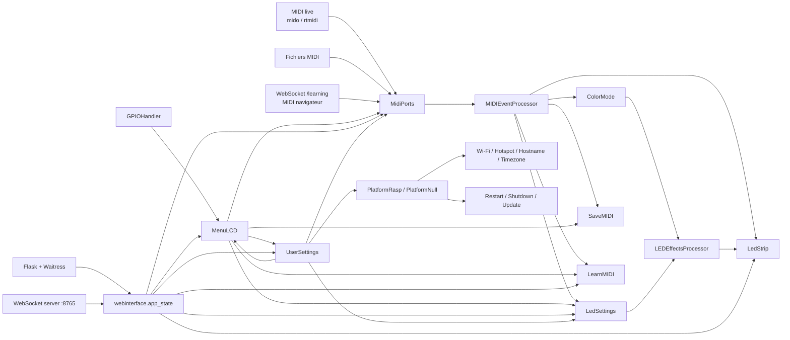
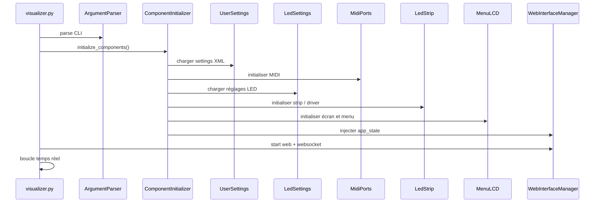
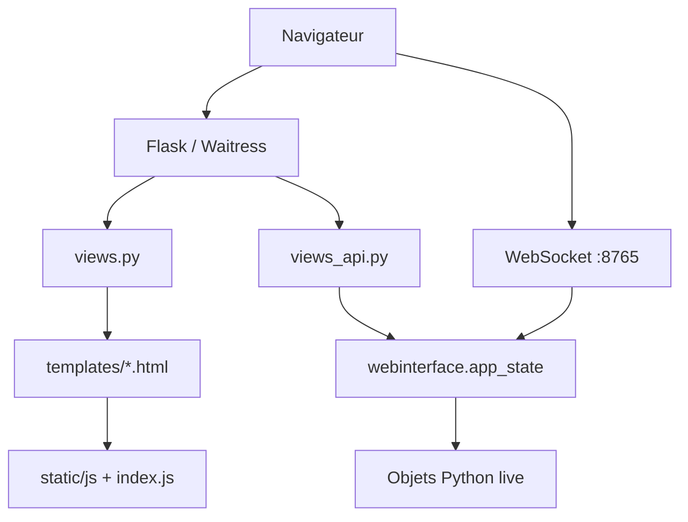
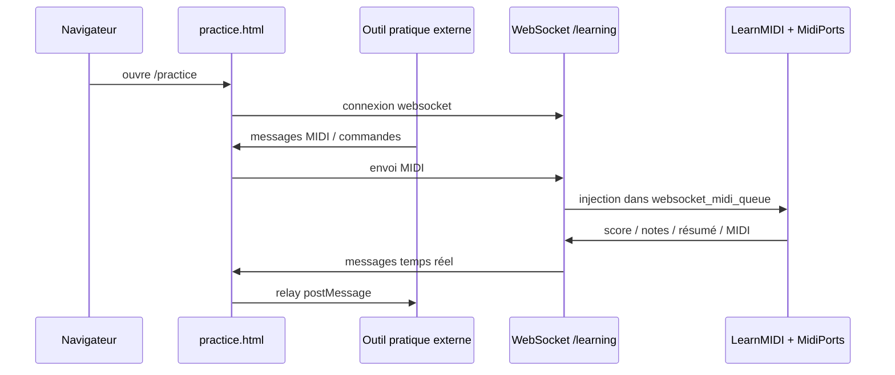

# Audit Technique Complet

Projet audité : `Piano-LED-Visualizer`  
Version auditée : état du dépôt local au `2026-04-02`  
Public cible : développeurs humains et futures IA chargées de maintenir, corriger ou faire évoluer le projet.

## 1. Objectif du projet

`Piano-LED-Visualizer` est une application Python orientée Raspberry Pi qui transforme des événements MIDI en effets visuels sur un ruban LED aligné avec un clavier de piano. Le projet ne se limite pas à l’affichage LED :

- il pilote un ruban LED physique ou un émulateur logiciel ;
- il lit du MIDI en direct ou depuis des fichiers ;
- il expose une interface Web complète en Flask + WebSocket ;
- il gère un écran LCD et des boutons physiques ;
- il embarque un mode d’apprentissage/pratique ;
- il sait enregistrer, rejouer, colorer et séquencer des comportements LED ;
- il gère des fonctions système Raspberry Pi : Wi-Fi, hotspot, nom réseau local, mise à jour, redémarrage, extinction.

En pratique, c’est un système embarqué multi-interface :

- interface physique : boutons + écran LCD ;
- interface Web : configuration, contrôle, pratique, upload, profils ;
- interface MIDI : entrées matérielles, fichiers `.mid`, WebSocket pratique ;
- interface système : services, réseau, connectivité locale.

## 2. Résumé exécutif

L’architecture réelle repose sur un noyau Python unique lancé par [`visualizer.py`](../visualizer.py), qui :

- instancie tous les composants ;
- met en commun un grand état mutable partagé ;
- fait tourner une boucle principale temps réel ;
- démarre le serveur Web ;
- coordonne le LCD, les GPIO, le MIDI, les animations, l’apprentissage et les fonctions système.

Le projet est fonctionnellement riche, mais son architecture est très couplée :

- beaucoup d’objets sont mutables et partagés ;
- une grande partie des interactions passent par injection d’instances croisées ;
- le serveur Web manipule directement les objets du runtime ;
- plusieurs threads travaillent en parallèle sans couche claire d’isolation ;
- certains modules sont monolithiques, surtout côté Web et LCD.

Ce n’est pas une architecture “clean” ni hexagonale. C’est une architecture pragmatique de produit embarqué : efficace, mais avec une dette technique notable. Pour l’améliorer, il faut d’abord bien comprendre les flux de données, les responsabilités effectives des modules et les hypothèses Raspberry Pi/Linux disséminées dans le code.

## 3. Vue d’ensemble de l’architecture

### 3.1 Schéma global



### 3.2 Plans fonctionnels

Le système se structure autour de 6 sous-systèmes principaux :

1. `Runtime temps réel`
   - boucle principale, LED, MIDI, états, animations, activité.
2. `Configuration persistée`
   - XML utilisateur, XML par défaut, XML menu, XML séquences.
3. `Interface matérielle`
   - écran LCD Waveshare, boutons, GPIO, écran de veille.
4. `Interface Web`
   - Flask, templates HTML, JS front, API de contrôle, WebSockets.
5. `Mode apprentissage`
   - lecture guidée, score, prédiction de notes, profils, sauvegardes.
6. `Intégration système Raspberry Pi`
   - Wi-Fi, hotspot, nom `.local`, timezone, SPI, packages, services.

## 4. Cartographie du dépôt

### 4.1 Arborescence logique

```text
Piano-LED-Visualizer/
├── visualizer.py
├── requirements.txt
├── autoinstall.sh
├── README.md
├── config/
│   ├── default_settings.xml
│   ├── settings.xml
│   ├── menu.xml
│   ├── sequences.xml
│   └── presets/
├── lib/
├── webinterface/
├── Docs/
├── Songs/
├── tests/
└── .github/workflows/
```

### 4.2 Ordres de grandeur

Mesure approximative du dépôt utile auditée localement :

- Python : ~45 fichiers, ~15k lignes ;
- JavaScript : ~24 fichiers, ~13k lignes ;
- templates HTML : ~13 fichiers, ~5.3k lignes ;
- XML de configuration : ~3 fichiers principaux, ~700 lignes.

Le volume critique est réparti entre backend Python temps réel, backend Flask/API, frontend JavaScript traditionnel et configuration XML.

## 5. Démarrage et cycle de vie

### 5.1 Point d’entrée

Le point d’entrée unique est [`visualizer.py`](../visualizer.py).

Responsabilités principales :

- poser un verrou singleton ;
- installer `SIGTERM` et `SIGINT` ;
- parser les arguments CLI ;
- créer tous les composants ;
- exposer les composants au serveur Web ;
- faire tourner la boucle principale.

### 5.2 Séquence de démarrage



### 5.3 Rôle de `ComponentInitializer`

[`lib/component_initializer.py`](../lib/component_initializer.py) est le vrai orchestrateur de bootstrap.

Il procède par phases :

- phase 1 en parallèle : `PlatformRasp/PlatformNull`, `UserSettings`, `SaveMIDI` ;
- phase 2 en parallèle : `MidiPorts`, `LedSettings` ;
- puis séquentiellement : `LedStrip`, `Hotspot`, `LearnMIDI`, `MenuLCD`.

Ensuite, il prépare le runtime :

- désactivation de scripts MIDI système hérités ;
- installation éventuelle de `midi2abc` ;
- chargement/génération des colormaps ;
- génération des aperçus Web ;
- démarrage de l’animation de startup ;
- croisement des références entre objets via `add_instance(...)` ;
- affichage initial du menu LCD ;
- démarrage du thread de surveillance MIDI ;
- remplissage initial du ruban LED.

### 5.4 Modes de lancement et arguments CLI

[`lib/argument_parser.py`](../lib/argument_parser.py) définit les options de lancement les plus importantes :

- `--clear` ;
- `--display` ;
- `--fontdir` ;
- `--port` ;
- `--skipupdate` ;
- `--webinterface` ;
- `--rotatescreen` ;
- `--appmode` ;
- `--leddriver`.

Les deux paramètres les plus structurants pour comprendre le comportement sont :

- `--appmode`
  - `platform` si le matériel GPIO est disponible ;
  - sinon fallback vers un mode plus applicatif.
- `--leddriver`
  - `rpi_ws281x` pour le ruban réel ;
  - `emu` pour l’émulation.

Ces options sont importantes pour toute IA qui voudrait reproduire un bug hors Raspberry Pi.

### 5.5 Verrou singleton et hypothèses POSIX

Le démarrage comporte aussi une hypothèse système importante :

- [`visualizer.py`](../visualizer.py) importe `fcntl` ;
- `ensure_singleton()` pose un `flock` exclusif non bloquant sur le fichier du script ;
- en cas d’exception pendant cette opération, le code appelle `os.execl(...)` pour relancer le script.

Conséquences :

- le mécanisme est naturellement orienté Linux/POSIX ;
- ce n’est pas un vrai verrou cross-platform ;
- une future IA doit garder cela en tête avant de conclure qu’un problème de démarrage est “applicatif”.

## 6. Boucle principale et logique temps réel

La boucle principale se situe dans `VisualizerApp.main_loop()` dans [`visualizer.py`](../visualizer.py).

Elle effectue en continu :

- gestion du hotspot via `platform.manage_hotspot(...)` ;
- mise à jour d’état via `StateManager` ;
- écran de veille et logique d’inactivité ;
- animation idle ;
- gestion du backlight ;
- rafraîchissement de l’écran LCD ;
- prise en compte des changements de réglages ;
- lecture des boutons GPIO ;
- calcul des effets de fade/pulse ;
- traitement des événements MIDI ;
- envoi final vers le ruban LED si quelque chose a changé.

### 6.1 `StateManager`

[`lib/state_manager.py`](../lib/state_manager.py) adapte le comportement selon l’activité.

États :

- `ACTIVE_USE`
- `NORMAL`
- `IDLE`

Effets concrets :

- délai de boucle variable ;
- fréquence de refresh écran variable ;
- décision de lancer des animations d’inactivité ;
- extinction écran / screensaver après délai configurable.

## 7. Architecture des états partagés

Le projet repose sur plusieurs “gros objets d’état”.

### 7.1 `UserSettings`

[`lib/usersettings.py`](../lib/usersettings.py)

Rôle :

- persister les réglages utilisateurs dans `config/settings.xml` ;
- fusionner les clés manquantes depuis `config/default_settings.xml` ;
- fournir une API d’accès clé/valeur ;
- mémoriser les changements en attente et les resets.

C’est la source de vérité persistée.

### 7.2 `LedSettings`

[`lib/ledsettings.py`](../lib/ledsettings.py)

Rôle :

- refléter les réglages LED actifs en mémoire ;
- stocker le mode d’éclairage, les couleurs, séquences, offsets de notes ;
- servir de point de mutation central pour les changements LCD/Web ;
- appliquer `config/sequences.xml`.

C’est la source de vérité runtime pour l’affichage LED.

### 7.3 `LedStrip`

[`lib/ledstrip.py`](../lib/ledstrip.py)

Rôle :

- encapsuler le pilote LED réel ou émulé ;
- convertir notes MIDI -> positions physiques ;
- maintenir l’état courant des touches et couleurs ;
- exposer les pixels pour l’émulateur WebSocket.

### 7.4 `MidiPorts`

[`lib/midiports.py`](../lib/midiports.py)

Rôle :

- gérer les ports d’entrée/sortie MIDI ;
- recevoir les messages live ;
- empiler les événements dans des files ;
- reconnecter automatiquement les périphériques ;
- relayer du MIDI WebSocket pendant le mode pratique.

### 7.5 `MenuLCD`

[`lib/menulcd.py`](../lib/menulcd.py)

Rôle :

- représenter l’interface locale physique ;
- rendre les menus depuis `config/menu.xml` ;
- piloter la plupart des actions locales.

### 7.6 `webinterface.app_state`

[`webinterface/__init__.py`](../webinterface/__init__.py)

Rôle :

- stocker des références globales à tous les objets runtime ;
- être le pont entre Flask/WebSocket et le moteur Python principal.

Point clé : le Web n’est pas isolé. Il manipule directement les objets métier actifs.

### 7.7 Inventaire complémentaire des modules backend

Modules utiles à connaître mais moins centraux que `visualizer.py`, `MidiPorts` ou `MenuLCD` :

- [`lib/functions.py`](../lib/functions.py)
  - utilitaires métier transverses : lecture MIDI, animations, backlight, mapping note -> LED, screensaver.
- [`lib/webinterface_manager.py`](../lib/webinterface_manager.py)
  - démarre Waitress, injecte les objets runtime dans `app_state`, lance le serveur WebSocket.
- [`lib/animation_speed.py`](../lib/animation_speed.py)
  - convertit les presets de vitesse d’animation en délais concrets.
- [`lib/led_animations.py`](../lib/led_animations.py)
  - registre d’animations et lancement des threads d’animation.
- [`lib/savemidi.py`](../lib/savemidi.py)
  - enregistrement MIDI et sauvegarde des morceaux générés.
- [`lib/score_manager.py`](../lib/score_manager.py)
  - calcul du score, combo et pénalités du mode apprentissage.
- [`lib/rpi_drivers.py`](../lib/rpi_drivers.py)
  - détection des librairies hardware réelles et fallback éventuel.
- [`lib/null_drivers.py`](../lib/null_drivers.py)
  - stubs pour exécuter l’application sans matériel.
- [`lib/LED_drivers.py`](../lib/LED_drivers.py)
  - pilote d’émulation `PixelStrip_Emu` utilisé hors hardware réel.

## 8. Sous-système MIDI

### 8.1 Entrées MIDI supportées

Le moteur sait consommer :

- MIDI live via `mido` + `python-rtmidi` ;
- MIDI issu de fichiers `.mid` ;
- MIDI injecté via WebSocket dans le mode pratique ;
- contrôles spécifiques servant à faire avancer des séquences LED.

### 8.2 `MidiPorts`

[`lib/midiports.py`](../lib/midiports.py) gère :

- la découverte des ports ;
- l’ouverture de ports configurés ou par défaut ;
- les files d’événements `midi_queue`, `midifile_queue`, `websocket_midi_queue` ;
- le callback d’entrée ;
- la reconnexion automatique.

Comportement notable :

- si la file est pleine, le code essaie de préserver prioritairement les événements de notes ;
- en mode pratique, le MIDI live peut être retransmis vers le navigateur.

### 8.3 Connexions ALSA / `aconnect`

[`lib/connectall.py`](../lib/connectall.py) pilote les connexions ALSA entre ports.

Le projet mélange :

- une gestion applicative interne des ports ;
- un héritage d’installation système via `aconnect` et script `connectall.py`.

Cette cohabitation est une zone sensible.

### 8.4 Traitement des messages : `MIDIEventProcessor`

[`lib/midi_event_processor.py`](../lib/midi_event_processor.py) est le cœur du runtime musical.

Responsabilités :

- choisir la bonne source d’événements selon le contexte ;
- dépiler les messages avec budget temps borné ;
- traiter `note_on`, `note_off`, `control_change` ;
- mettre à jour l’activité ;
- appeler la logique de couleur ;
- alimenter l’enregistreur MIDI ;
- préparer l’état LED à afficher.

### 8.5 Flux principal des notes

```mermaid
flowchart LR
    IN[Message MIDI] --> QUEUE[Queue MidiPorts]
    QUEUE --> PROC[MIDIEventProcessor]
    PROC --> MODE[ColorMode]
    PROC --> STATE[LedStrip.keylist / keylist_color / sustain / pulses]
    STATE --> FX[LEDEffectsProcessor]
    FX --> SHOW[strip.show()]
```

### 8.6 Modes d’impact d’une note

Selon `ledsettings.mode`, une note active différemment le ruban :

- `Normal` : intensité fixe ;
- `Fading` : décroissance progressive ;
- `Velocity` : dépend de la vélocité ;
- `Pedal` : comportement dépendant de la pédale ;
- `Pulse` : onde d’expansion/attaque/sustain/release.

### 8.7 Contrôles spéciaux

Particularités notables :

- `CC64` gère la sustain ;
- certains `control_change` peuvent faire avancer une séquence LED ;
- les canaux 11/12 servent aux indications de mains dans l’apprentissage.

## 9. Sous-système couleur et rendu LED

### 9.1 `ColorMode`

[`lib/color_mode.py`](../lib/color_mode.py)

Famille de stratégies couleur :

- `SingleColor`
- `Multicolor`
- `Rainbow`
- `SpeedColor`
- `Gradient`
- `ScaleColoring`
- `VelocityRainbow`

Chaque mode répond à des événements MIDI et peut aussi recalculer sa couleur dans le temps.

### 9.2 `colormaps`

[`lib/colormaps.py`](../lib/colormaps.py)

Rôle :

- générer ou charger des colormaps ;
- gérer les aperçus ;
- construire dynamiquement une colormap synthétique pour le mode multicolore.

La génération dépend du gamma LED, donc un changement de gamma peut nécessiter une régénération des gradients.

### 9.3 `LedStrip`

Le ruban LED est géré par [`lib/ledstrip.py`](../lib/ledstrip.py).

Données clés :

- `keylist`
- `keylist_status`
- `keylist_color`
- `keylist_sustained`
- `keylist_external_software`
- `active_pulses`

Pilotes possibles :

- réel : `rpi_ws281x`
- émulé : `PixelStrip_Emu`

### 9.4 Placement des notes sur les LEDs

La formule centrale passe par [`lib/functions.py`](../lib/functions.py), fonction `get_note_position(...)`.

Logique :

- note de base : 20 ;
- densité LED issue de `leds_per_meter / 72` ;
- application des offsets configurés ;
- application du `shift` global ;
- inversion éventuelle si `reverse`.

### 9.5 Effets temporels

[`lib/led_effects_processor.py`](../lib/led_effects_processor.py) applique les transformations par frame :

- fade ;
- décroissance de vélocité ;
- comportement sustain ;
- pulses ;
- couleurs dynamiques de type rainbow/gradient ;
- fallback vers backlight si aucune note n’est active.

## 10. Séquences, presets et logique de configuration

### 10.1 Fichiers XML structurants

Les fichiers les plus importants sont :

- [`config/default_settings.xml`](../config/default_settings.xml)
- [`config/settings.xml`](../config/settings.xml)
- [`config/menu.xml`](../config/menu.xml)
- [`config/sequences.xml`](../config/sequences.xml)

### 10.2 `default_settings.xml`

Ce fichier décrit une grande partie du comportement du produit :

- écran et couleurs UI ;
- type d’écran ;
- luminosité ;
- modes couleur ;
- paramètres rainbow/velocity/pulse/fade ;
- multicolore et plages ;
- backlight/adjacent ;
- offsets de notes ;
- mode apprentissage ;
- hotspot et réseau ;
- port Web ;
- réglages d’animations et de délais.

### 10.3 `menu.xml`

Ce XML pilote le menu LCD physique :

- structure hiérarchique ;
- intitulés ;
- choix disponibles ;
- navigation utilisateur locale.

### 10.4 `sequences.xml`

Ce XML permet de définir des séquences pilotées par MIDI :

- numéro de contrôle déclencheur ;
- nom de la séquence ;
- ordre des étapes ;
- mode et couleur de chaque étape.

Le runtime les applique via `LedSettings.set_sequence(...)`.

### 10.5 Presets Web

Le dossier `config/presets/` sert au stockage de presets exportables/importables via l’API Web.

Un preset ne représente pas nécessairement l’état complet du système : surtout les réglages LED.

## 11. Interface LCD et contrôles physiques

### 11.1 `GPIOHandler`

[`lib/gpio_handler.py`](../lib/gpio_handler.py)

Rôle :

- lire les boutons et le joystick ;
- naviguer dans le menu ;
- modifier des valeurs ;
- déclencher certaines actions rapides ;
- signaler l’activité utilisateur à `StateManager`.

### 11.2 `MenuLCD`

[`lib/menulcd.py`](../lib/menulcd.py) est un module massif qui :

- parse `config/menu.xml` ;
- affiche le menu sur les écrans 1.44" ou 1.3" ;
- rend des barres de couleurs et aperçus spécialisés ;
- orchestre les changements de réglages ;
- contrôle lecture, enregistrement, apprentissage, réseau, séquences, animations et actions système.

Constat important :

- le LCD n’est pas une simple vue ;
- c’est aussi un contrôleur métier riche ;
- beaucoup d’actions système passent par lui.

### 11.3 Écran de veille et animation idle

Le projet distingue plusieurs notions :

- `screen_off_delay` ;
- `screensaver_delay` ;
- `idle_timeout_minutes` ;
- `idle_animation_delay` et planning optionnel.

Une partie de cette logique se trouve dans [`lib/functions.py`](../lib/functions.py) et une autre dans [`lib/state_manager.py`](../lib/state_manager.py).

### 11.4 Pilotes LCD bas niveau

Sous `MenuLCD`, il existe une couche matérielle plus basse :

- [`lib/LCD_Config.py`](../lib/LCD_Config.py)
  - interface SPI/GPIO pour l’écran ;
- [`lib/LCD_1in44.py`](../lib/LCD_1in44.py)
  - pilote bas niveau du panneau 1.44" ;
- [`lib/LCD_1in3.py`](../lib/LCD_1in3.py)
  - pilote bas niveau du panneau 1.3".

Ces modules proviennent clairement de code fournisseur Waveshare adapté/intégré au projet. Ils ne portent pas la logique métier du visualizer, mais ils sont structurants pour tout diagnostic écran, SPI ou compatibilité matérielle.

## 12. Interface Web

### 12.1 Architecture générale

Le Web est composé de :

- Flask pour les routes HTML ;
- Waitress pour le serveur WSGI ;
- un serveur WebSocket séparé sur le port `8765` ;
- un frontend HTML/JS traditionnel multi-pages chargées dynamiquement.

Le serveur HTTP est démarré par [`lib/webinterface_manager.py`](../lib/webinterface_manager.py).

### 12.2 Schéma Web



### 12.3 `webinterface/__init__.py`

Ce module :

- crée l’application Flask ;
- instancie `AppState` ;
- démarre le serveur WebSocket ;
- gère deux canaux :
  - `/learning`
  - `/ledemu`

### 12.4 Routes HTML

[`webinterface/views.py`](../webinterface/views.py) fournit les pages :

- `/`
- `/home`
- `/ledsettings`
- `/ledanimations`
- `/songs`
- `/sequences`
- `/ports`
- `/network`
- `/practice`

Chaque requête met aussi à jour l’activité utilisateur, ce qui a un effet sur l’état du système.

### 12.5 API de contrôle

[`webinterface/views_api.py`](../webinterface/views_api.py) est l’un des plus gros modules du dépôt.

Responsabilités :

- lecture/écriture de réglages ;
- réseau Wi-Fi ;
- gestion des ports MIDI ;
- contrôle lecture/enregistrement ;
- séquences ;
- presets ;
- profils ;
- pratique ;
- actions système ;
- téléchargement de logs ;
- horaire/temps/timezones.

Constat architectural :

- c’est un contrôleur monolithique ;
- beaucoup de mutations passent par des requêtes `GET` ;
- la logique métier et la logique HTTP y sont fortement mélangées.

### 12.6 Frontend JavaScript

Fichiers structurants :

- [`webinterface/static/index.js`](../webinterface/static/index.js)
- [`webinterface/static/js/initialize.js`](../webinterface/static/js/initialize.js)
- [`webinterface/static/js/ui.js`](../webinterface/static/js/ui.js)
- [`webinterface/static/js/profiles.js`](../webinterface/static/js/profiles.js)

Caractéristiques :

- chargement AJAX des sous-pages ;
- beaucoup de variables globales ;
- logique UI et appels API fortement imbriqués ;
- usage de Chart.js pour les graphiques ;
- usage de WebSocket pour pratique et émulateur LED.

Observation importante :

[`webinterface/static/js/profiles.js`](../webinterface/static/js/profiles.js) contient deux implémentations de logique profils, probablement héritées ou dupliquées.

### 12.7 Helpers front, i18n et sous-pages spécialisées

Plusieurs fichiers secondaires sont en réalité fonctionnels et doivent être connus :

- [`webinterface/static/js/globals.js`](../webinterface/static/js/globals.js)
  - variables globales partagées ;
- [`webinterface/static/js/utils.js`](../webinterface/static/js/utils.js)
  - conversions couleur, formatage, utilitaires d’UI ;
- [`webinterface/static/js/files.js`](../webinterface/static/js/files.js)
  - upload de fichiers et barre de progression ;
- [`webinterface/static/js/metronome.js`](../webinterface/static/js/metronome.js)
  - métronome navigateur avec correction de dérive via `AdjustingInterval` ;
- [`webinterface/static/js/notifications.js`](../webinterface/static/js/notifications.js)
  - système d’alertes/confirmations personnalisé ;
- [`webinterface/static/js/number-input.js`](../webinterface/static/js/number-input.js)
  - enrichissement dynamique des champs numériques ;
- [`webinterface/static/translations.js`](../webinterface/static/translations.js)
  - couche de traduction et sélection de langue via cookie.

Templates et pages spécialisées à connaître :

- [`webinterface/templates/ledcolor.html`](../webinterface/templates/ledcolor.html)
  - sous-panneau des modes couleur ;
- [`webinterface/templates/lightmode.html`](../webinterface/templates/lightmode.html)
  - sous-panneau des modes lumineux ;
- [`webinterface/templates/songs_list.html`](../webinterface/templates/songs_list.html)
  - rendu AJAX paginé/trié de la bibliothèque de morceaux ;
- [`webinterface/templates/sheet_music.html`](../webinterface/templates/sheet_music.html)
  - rendu de partition synchronisée via `abc2svg`/MusicXML avec offset ajustable ;
- [`webinterface/static/ledemu.html`](../webinterface/static/ledemu.html)
  - page autonome d’émulation LED branchée au WebSocket `/ledemu`.

Autrement dit, le frontend ne se limite pas à quelques pages statiques. Il contient aussi :

- une internationalisation embarquée ;
- un métronome local ;
- un visualiseur LED navigateur ;
- une couche de partition synchronisée.

## 13. Mode pratique / apprentissage

### 13.1 Vision globale

Le mode pratique combine :

- lecture de morceaux MIDI ;
- guidage visuel ;
- score ;
- profils utilisateurs ;
- communication navigateur <-> backend par WebSocket ;
- intégration d’un outil externe dans une iframe.

### 13.2 `LearnMIDI`

[`lib/learnmidi.py`](../lib/learnmidi.py) porte la logique principale :

- chargement et fusion des pistes MIDI ;
- identification des mains par canaux ;
- cache des morceaux ;
- prédiction des notes futures ;
- gestion des erreurs de jeu ;
- moteur de score ;
- génération d’un résumé de session ;
- interaction avec `ProfileManager`.

### 13.3 `ProfileManager`

[`lib/profile_manager.py`](../lib/profile_manager.py)

Base SQLite :

- `profiles`
- `highscores`
- `learning_settings`

Fichier BD :

- `data/profiles.db` si chemin relatif.

### 13.4 Pratique Web et iframe externe

La page [`webinterface/templates/practice.html`](../webinterface/templates/practice.html) embarque une iframe pointant vers `practice_tool_url`.

Par défaut :

- `https://piano-visualizer.pages.dev`

Flux simplifié :



Conclusion importante : le mode pratique n’est pas purement local. Il dépend aussi d’un outil externe embarqué.

## 14. Lecture, enregistrement et gestion des morceaux

### 14.1 Lecture de fichiers MIDI

[`lib/functions.py`](../lib/functions.py), fonction `play_midi(...)` :

- lit un `.mid` ;
- envoie le flux à un port de sortie ;
- pousse les événements dans `midifile_queue` ;
- gère la compensation de dérive temporelle ;
- vide le ruban à la fin.

### 14.2 Enregistrement

[`lib/savemidi.py`](../lib/savemidi.py)

Capacités :

- démarrer un enregistrement ;
- annuler ;
- sauvegarder sous `Songs/`.

Particularité :

- en mode multicolore, l’enregistrement peut créer plusieurs fichiers, dont un suffixé `_main.mid` qui sert de fichier agrégateur logique.

## 15. Plateforme Raspberry Pi et intégration système

### 15.1 Abstraction de plateforme

[`lib/platform.py`](../lib/platform.py) définit :

- `PlatformNull` : version no-op hors Raspberry Pi ;
- `PlatformRasp` : intégration réelle avec l’OS.

Fonctions gérées côté Raspberry Pi :

- activation SPI ;
- installation de dépendances système ;
- hotspot Wi-Fi ;
- scan Wi-Fi ;
- connexion/déconnexion ;
- changement de hostname ;
- découverte d’adresse locale ;
- réglage timezone ;
- reboot, shutdown, restart ;
- mise à jour du visualizer ;
- restart de `rtpmidid`.

### 15.2 Hotspot

Le hotspot est géré à la fois :

- via les réglages XML ;
- via `Hotspot` et `PlatformRasp` ;
- via une logique d’auto-réactivation si plus de Wi-Fi et longue inactivité.

### 15.3 Mise à jour applicative

`PlatformRasp.update_visualizer()` effectue une mise à jour agressive qui inclut des commandes destructrices de dépôt.

Conséquence :

- pratique pour un appareil terrain ;
- dangereuse pour un dépôt local modifié.

### 15.4 Détection de capot / cover sensor

[`lib/functions.py`](../lib/functions.py) initialise un capteur de capot sur `GPIO 12` via la constante `SENSECOVER`.

Ce signal est réutilisé dans de nombreuses animations :

- tant que le capot est considéré fermé, certaines animations attendent ;
- le ruban peut être vidé lors d’un changement d’état.

Documentation matérielle associée :

- [`Docs/cover_detection.md`](../Docs/cover_detection.md)

Ce point est important car il peut expliquer des “animations bloquées” qui ne sont en fait qu’un comportement prévu lié au matériel.

## 16. Dépendances

### 16.1 Dépendances Python runtime

Issues de [`requirements.txt`](../requirements.txt) :

- `RPi.GPIO`
- `webcolors`
- `psutil`
- `mido`
- `Pillow`
- `python-rtmidi`
- `rpi-ws281x`
- `spidev`
- `numpy`
- `Flask`
- `waitress`
- `websockets`
- `Werkzeug`

### 16.2 Dépendances front-end

Le frontend utilise notamment :

- Chart.js ;
- plugins Chart.js annotation / zoom ;
- Alpine.js ;
- jQuery ;
- `html-midi-player.js` ;
- `abc2svg` ;
- `xml2abc` ;
- Tailwind CSS via [`webinterface/package.json`](../webinterface/package.json).

### 16.3 Dépendances système externes

Le projet dépend aussi d’outils et paquets système :

- `aconnect` / ALSA ;
- `nmcli` ;
- `iwlist` ;
- `hostnamectl` ;
- `timedatectl` ;
- `avahi-daemon` ;
- `midi2abc` ;
- environnement Raspberry Pi avec SPI/GPIO.

## 17. Concurrence, threads et événements

Le projet est multi-threadé.

Threads et boucles importantes :

- boucle principale de `visualizer.py` ;
- serveur Waitress avec pool de threads ;
- boucle asyncio du serveur WebSocket ;
- thread de surveillance MIDI / reconnexion ;
- threads d’animations ;
- threads de lecture, apprentissage et enregistrement selon les cas ;
- tâches d’initialisation en arrière-plan.

Conséquence architecturale :

- beaucoup d’état partagé sans couche claire de synchronisation ;
- risques de course modérés mais réels ;
- nécessité de préserver les conventions existantes si on modifie les objets live.

## 18. Déploiement, installation et image système

### 18.1 `autoinstall.sh`

[`autoinstall.sh`](../autoinstall.sh) automatise :

- installation des dépendances système ;
- configuration du projet ;
- mise en place du service ;
- installation de scripts auxiliaires historiques.

### 18.2 GitHub Actions

Le workflow [`.github/workflows/main.yml`](../.github/workflows/main.yml) construit une image Raspberry Pi.

Faits notables :

- hostname prévu : `pianoledvisualizer` ;
- adresse locale attendue : `pianoledvisualizer.local` ;
- utilisateur créé : `plv` ;
- mot de passe : `visualizer`.

Observation sensible :

- le workflow copie un `connectall.py` à la racine alors que le dépôt actuel centralise surtout cette logique dans [`lib/connectall.py`](../lib/connectall.py) ;
- cela suggère un héritage ou un risque de divergence entre l’image et le runtime actuel.

### 18.3 Documentation annexe déjà présente

Le dépôt contient aussi une documentation opérationnelle utile à ne pas ignorer :

- [`README.md`](../README.md)
  - vue d’ensemble, BOM matérielle, contexte produit, accès Web ;
- [`Docs/features.md`](../Docs/features.md)
  - catalogue fonctionnel illustré côté utilisateur ;
- [`Docs/manual_installation.md`](../Docs/manual_installation.md)
  - installation manuelle détaillée ;
- [`Docs/wifi_setup.md`](../Docs/wifi_setup.md)
  - préparation Wi-Fi/SSH avant premier boot ;
- [`Docs/autohotspot.md`](../Docs/autohotspot.md)
  - notes historiques sur la logique hotspot ;
- [`Docs/external_devices.md`](../Docs/external_devices.md)
  - topologies matérielles externes, RTP-MIDI, Sevilla USB-USB, Android ;
- [`Docs/btconnection.md`](../Docs/btconnection.md)
  - notes Bluetooth MIDI ;
- [`Docs/RPICaseModel.stl`](../Docs/RPICaseModel.stl)
  - modèle principal de boîtier ;
- [`Docs/RPICase-nohat.stl`](../Docs/RPICase-nohat.stl)
  - variante de boîtier sans ouverture HAT ;
- [`Docs/RPICase-nohdmi-nosdv2.stl`](../Docs/RPICase-nohdmi-nosdv2.stl)
  - variante de boîtier simplifiée.

Toutes ces docs ne sont pas forcément à jour au même niveau que le code, mais elles capturent des hypothèses matérielles réelles du projet.

## 19. Tests et qualité

### 19.1 État des tests

Le dossier [`tests/`](../tests/) contient peu de vrais tests unitaires.

Constat local :

- certains fichiers ressemblent davantage à des scripts de test matériel qu’à une suite CI portable ;
- `tests/test_screen.py` dépend de `spidev` ;
- `tests/test_usersettings.py` est bloqué sur Windows par un chemin de log Linux codé en dur.

### 19.2 Problèmes observés pendant l’audit

Exécution locale sous Windows :

- échec de collecte des tests à cause de `spidev` absent ;
- échec additionnel à cause de [`lib/log_setup.py`](../lib/log_setup.py) qui écrit dans `/home/Piano-LED-Visualizer/visualizer.log`.

Conclusion :

- le dépôt n’est pas totalement portable hors Raspberry Pi/Linux ;
- la couche “mode app/émulateur” existe, mais la compatibilité multiplateforme n’est pas complète.

## 20. Observabilité et logs

### 20.1 Logging

[`lib/log_setup.py`](../lib/log_setup.py) configure :

- un logger console ;
- un `RotatingFileHandler`.

Problème important :

- le chemin du log est codé en dur vers `/home/Piano-LED-Visualizer/visualizer.log`.

Impact :

- casse certains usages non Linux ;
- complique les tests ;
- révèle une hypothèse forte sur l’emplacement d’installation.

### 20.2 Consultation des logs

L’API Web expose aussi un accès aux logs via l’interface.

Cela peut être utile pour de futures IA opérant à distance, mais la fiabilité dépend du chemin de fichier effectivement utilisé sur la machine.

## 21. Points forts du projet

- produit très complet pour un usage embarqué réel ;
- bonne couverture fonctionnelle des besoins piano/MIDI/LED ;
- présence d’un mode pratique ambitieux ;
- fallbacks partiels hors matériel Raspberry Pi ;
- configuration riche et relativement transparente grâce aux XML ;
- déploiement Pi automatisé ;
- interface locale LCD + interface Web + pratique Web.

## 22. Zones fragiles et dette technique

### 22.1 Couplage fort

- beaucoup d’objets se connaissent directement ;
- les mutations se propagent par références partagées ;
- le Web agit directement sur le runtime.

### 22.2 Modules trop gros

- [`lib/menulcd.py`](../lib/menulcd.py)
- [`webinterface/views_api.py`](../webinterface/views_api.py)
- [`webinterface/static/js/ui.js`](../webinterface/static/js/ui.js)

### 22.3 Hypothèses de chemin

- logs codés en dur ;
- documentation et scripts d’installation pas toujours alignés ;
- divergence potentielle entre `/home/Piano-LED-Visualizer` et `/home/plv/Piano-LED-Visualizer`.

### 22.4 Dette historique MIDI

- coexistence de logique `aconnect` historique ;
- scripts système hérités ;
- désactivation partielle au démarrage ;
- workflow image potentiellement pas totalement synchronisé avec le code courant.

### 22.5 Frontend traditionnel très couplé

- beaucoup de JS global ;
- logique métier côté UI ;
- exécution de scripts injectés dynamiquement ;
- conventions implicites nombreuses.

### 22.6 Tests insuffisants

- faible couverture automatisable ;
- dépendances matérielles dans la suite ;
- absence d’une vraie séparation unit/integration/hardware.

### 22.7 Pièges techniques discrets

- [`visualizer.py`](../visualizer.py) dépend de `fcntl` pour le verrou singleton, ce qui renforce l’hypothèse Linux/POSIX au démarrage.
- [`lib/LED_drivers.py`](../lib/LED_drivers.py) a une borne stricte dans `setPixelColor(...)` (`0 < pos < self.leds`), ce qui ignore la LED d’index `0` dans l’émulateur logiciel.
- [`webinterface/templates/practice.html`](../webinterface/templates/practice.html) contient une logique iframe/WebSocket/postMessage plus complexe qu’elle n’en a l’air, avec fallback d’URL, validation d’origine, fullscreen et backups.

## 23. Recommandations de refactor pour futures IA

Ordre recommandé de travail :

1. Stabiliser l’observabilité et la portabilité.
2. Découper `views_api.py` par domaines.
3. Extraire des services métier hors de `MenuLCD` et de l’API.
4. Formaliser les contrats d’état de `LedSettings`, `LedStrip`, `MidiPorts`, `app_state`.
5. Simplifier le frontend et supprimer les doublons de `profiles.js`.
6. Clarifier la stratégie MIDI système et réaligner code, installateur et workflow image.

## 24. Guide rapide pour une future IA

Ordre de lecture conseillé :

1. [`visualizer.py`](../visualizer.py)
2. [`lib/component_initializer.py`](../lib/component_initializer.py)
3. [`lib/usersettings.py`](../lib/usersettings.py)
4. [`lib/ledsettings.py`](../lib/ledsettings.py)
5. [`lib/midiports.py`](../lib/midiports.py)
6. [`lib/midi_event_processor.py`](../lib/midi_event_processor.py)
7. [`lib/led_effects_processor.py`](../lib/led_effects_processor.py)
8. [`lib/functions.py`](../lib/functions.py)
9. [`lib/menulcd.py`](../lib/menulcd.py)
10. [`webinterface/__init__.py`](../webinterface/__init__.py)
11. [`webinterface/views_api.py`](../webinterface/views_api.py)
12. [`webinterface/static/js/ui.js`](../webinterface/static/js/ui.js)
13. [`lib/learnmidi.py`](../lib/learnmidi.py)
14. [`lib/platform.py`](../lib/platform.py)
15. les XML de `config/`

Questions à se poser avant toute modification :

- est-ce que je touche à l’état persistant ou seulement au runtime ?
- est-ce qu’une action Web doit aussi être accessible depuis le LCD ?
- est-ce qu’une modification impacte le mode pratique WebSocket ?
- est-ce que je casse une hypothèse Raspberry Pi/Linux implicite ?
- est-ce que le changement doit survivre à un redémarrage ?

## 25. Procédure de connexion au Raspberry Pi

Informations attendues par le projet et sa documentation :

- nom réseau local : `pianoledvisualizer.local`
- utilisateur : `plv`
- mot de passe : `visualizer`

### 25.1 Connexion SSH

Depuis un autre poste sur le même réseau :

```bash
ssh plv@pianoledvisualizer.local
```

Quand le mot de passe est demandé :

```text
visualizer
```

### 25.2 Connexion SFTP / SCP

Pour récupérer ou envoyer des fichiers :

```bash
scp fichier_local.mid plv@pianoledvisualizer.local:/home/plv/Piano-LED-Visualizer/Songs/
```

Ou en SFTP :

```bash
sftp plv@pianoledvisualizer.local
```

### 25.3 Service applicatif

Une fois connecté en SSH, commandes utiles :

```bash
systemctl status visualizer
systemctl restart visualizer
journalctl -u visualizer -n 200 --no-pager
```

### 25.4 Emplacement probable du projet sur le Pi

D’après le workflow d’image, le dépôt est prévu sous :

```text
/home/plv/Piano-LED-Visualizer
```

Attention :

- certains morceaux du code ou de la documentation supposent aussi `/home/Piano-LED-Visualizer` ;
- cette divergence doit être gardée en tête si un chemin semble cassé.

### 25.5 Hotspot intégré

Le projet gère aussi son propre hotspot Wi-Fi.

Éléments vus dans le code et la doc :

- SSID typique : `PianoLEDVisualizer`
- mot de passe : `visualizer`

Cela sert de plan B si le Pi n’est pas connecté à un réseau Wi-Fi classique.

## 26. Conclusion

`Piano-LED-Visualizer` est un produit embarqué complet et avancé, construit autour d’un moteur Python temps réel pilotant LED, MIDI, LCD, Web et fonctions système Raspberry Pi.

Sa force est sa richesse fonctionnelle. Sa faiblesse principale est son couplage élevé entre runtime, UI locale, UI Web et plateforme système. Toute amélioration future doit donc :

- comprendre d’abord les états partagés ;
- éviter les refactors globaux non préparés ;
- sécuriser la portabilité et les tests ;
- découper progressivement les gros modules.

Pour une future IA, la clé n’est pas seulement de lire le code, mais de comprendre que ce dépôt fonctionne comme un système embarqué vivant, à base d’objets partagés, de threads, de MIDI temps réel et d’intégration Raspberry Pi.
