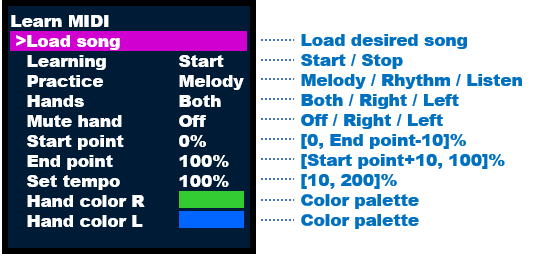

# Features

1. [Led settings](#ledsettings)
    1. [Color modes](#color_modes)
    2. [Light modes](#light_modes)
    3. [Other settings](#other_settings)
2. [Songs](#songs)
    1. [Recording](#recording)
    2. [Playing](#playing)
    3. [Learning](#learning)
    4. [Learning with Synthesia](#learning_with_synthesia)
    5. [Managing songs](#managing_songs)
3. [Sequences](#sequences)
4. [Led animations](#led_animations)

# Led settings <a name="ledsettings"></a>

Each setting can be changed from the web interface or RPi's screen.

## Color modes <a name="color_modes"></a>

- ### **Single**

  

- ### **Multicolor**

  You can define color and range. Keys without a defined range will create a gradient from the surrounding colors.

  

  

- ### **Rainbow**

  Creates a rainbow effect. You can edit the scale of rainbow and make it change in time (move left or right).

  

- ### **Velocity Rainbow**

  Color is based on the speed at which a key is pressed.-

  [Credits to](https://github.com/onlaj/Piano-LED-Visualizer/pull/454) [@stephen322](https://github.com/stephen322)

  

- ### **Speed**

  The color of the LEDs depends on the speed at which the keys are pressed.

  

- ### **Gradient**

  

- ### **Scale**

  Color depends on scale; in the example below, it lights black keys with a red color.

  

## Light modes <a name="light_modes"></a>

There are 3 modes

- ### Normal
- ### Fading

  When the key is released, it slowly turns off the LED.
- ### Velocity
  The faster (with more velocity) you press the key, the brighter the led will light up. It will also slowly fade
  when the key is released AND the sustain pedal is pressed. If the sustain pedal is not pressed, the fading effect is
  not present.

## Other settings <a name="other_settings"></a>

- ### Brightness
- ### Backlight
  It lights up all the keys when they are not pressed.
- ### Sides colors
  Light up 3 LEDs instead of 1. Adjacent LEDs can be set to a separate color.
- ### Skipped notes
  Allows to filter notes with left/right hand information. Useful when Synthesia is doubling the input
- ### Led count
  For keyboards with less than 88 keys
- ### Shift
  Helps align the LED strip
- ### Reverse
  For setups with led strip mounted from right to left (input cables on right)
- ### LED notes offset
  By default, it offsets LEDs by 1 for notes bigger than 55 and by 1 for notes bigger than 92.
  Can be modified if LEDs are not aligned with keys.

# Recording/playing songs <a name="songs"></a>

## Recording <a name="recording"></a>

Visualizer can record your playing. When Multicolor mode is selected, it will record each color on separate midi file.
Songs are saved into the "Songs" folder, they can be downloaded using the Web interface.


## Playing <a name="playing"></a>

Songs can be played directly in the Web interface or through your piano.
When playing in the browser, it also displays simple falling note visualisation.


## Learning <a name="learning"></a>

Visualizer comes with a built-in learning tool.
You can load any midi file, and it will light up the next-to-play key.
In the Web interface it will also show sheet music. Conversion is automatic and far from perfect,
so if it doesn't suit your needs you can load your custom sheet.

For practicing, the following 3 modes can be used:

- Melody: The song will wait for you to hit the correct notes. Take your time and try to avoid mistakes. Holding notes
  to their full duration is also important, otherwise you might develop muscle memory with the mistakes included.
- Rhythm: Adjust the speed using Set tempo option until you can play without mistakes. Play as fast as you can
  comfortably. Work your way up to 100% speed. Practice the Melody first to make this step easier.
- Listen: In this mode the song will play in listen only mode at the Set tempo speed.

Different combinations of practicing modes be realized using the Hands and Mute Hand options. To practice only a section
of the song, adjust the Start point and the End point values.


The sheet music is thoughtfully synchronized with your playing, providing real-time feedback by highlighting the
currently played part. Additionally, you have the freedom to change the tempo of the song, allowing you to practice at a pace that suits your
learning curve.

- **Generating music sheet**: To generate a printable music sheet from a MIDI file use the [Midi Sheet Music](http://midisheetmusic.com/) app. The app already contains a library of MIDI files that can be played.
- **Editing MIDI files**: To visualize and edit MIDI files use the [MidiEditor](https://www.midieditor.org/). Only type 1 of midi files have been tested. Other types of midi files might need to be adjusted in order to work with the Visualizer.


To enhance the learning experience, there are two optional features:

- Firstly, there is an option to light up incorrectly pressed keys with a red color, providing immediate feedback to
  help you identify and correct mistakes.

- Secondly, an option to light up future notes with a subtle faded glow, giving you a glimpse into the upcoming notes.





## Learning with Synthesia <a name="learning_with_synthesia"></a>

### We need to make a connection between your PC/MAC/Android. There are at least 3 ways of doing that: ###

## [Connection schematics](https://github.com/onlaj/Piano-LED-Visualizer/blob/master/Docs/external_devices.md)

**1. Sevilla's Soft MIDI USB-USB device**
This is, in my opinion, the best way to make connection between RPi and PC. It works with any device that support MIDI over USB, offers the lowest latency and no lost packets. The only downside is that it cost €39.00 (~48 USD) + shipping. You connect your Piano and PC to USB HUB connected to RPi and that's it, everything just works.
[Link to store](http://compasflamenco.com/midi-c-3/midi-usbusb-p-4.html)

**2. RTP MIDI** (MIDI by ethernet)
For this method you need to use some software on your Synthesia's device and both devices must be connected to the same local network.

- Windows: [rtpMIDI](https://www.tobias-erichsen.de/software/rtpmidi.html) by [Tobias Erichsen](https://www.tobias-erichsen.de/ "Tobias Erichsen") | [tutorial](http://www.tobias-erichsen.de/software/rtpmidi/rtpmidi-tutorial.html)

- MAC: [Tutorial](https://www.wiksnet.com/Home/Help)
- Android [Midi Connector Free](https://abrahamwisman.com/midiconnector) or [touchdaw](https://xmmc.de/touchdaw/)

Default port is 5004.

**3. Bluetooth**
This method is not recommended due to problems with establishing the first connection, especially on devices other than those with Windows 10.
If you still want to try, follow [this link](https://github.com/onlaj/Piano-LED-Visualizer/blob/master/Docs/btconnection.md) for instructions.


### Configuring Synthesia

You have to enable light support in Synthesia by setting "Key Light" option to "Finger-based channel".
In Visualizer settings you have to change "input" to either *RPI Bluetooth* (for bluetooth connection), *rtpmidi raspberrypi* (for RTP connections) or *MIDI USB-USB* (for cable connection).
After that when learning new song next-to-play keys will be illuminated in corresponding colors, blue for left hand and green for right hand.

If you are getting mixed colors, meaning that leds are lighting up with your predefined and next-to-play colors at the same time, you can use "Skipped notes" option in Visualizer to disable one of them.


## Managing songs <a name="managing_songs"></a>

You can search, sort, edit names, play, start learning, download, and delete songs through Web interface.


## Uploading

You can upload songs through the Web interface


In case of upload errors, use [Putty](https://www.putty.org/) or other app to connect to your RPi throught SSH to change the access permissions for the `Songs` folder:
```
cd /home/Piano-LED-Visualizer/
sudo chmod a+rwxX -R Songs/
```


# Sequences <a name="sequences"></a>

## Using the sequences

In the visualizer menu and in the web interface you can find a setting called "Sequences".
It allows you to change led properties while playing using the third key on Waveshare hat, your piano pedals,
or by clicking "next step"/pressing space in the Web interface.
You can edit or create new sequences by editing the "sequences.xml" file or through Web interface.
The "control_number" defines which pedal is used to go to the next step.

| Control number | Pedal name                         |
|----------------|------------------------------------|
| 64             | Damper Pedal (Sustain/Hold) On/Off |
| 65             | Portamento On/Off                  |
| 66             | Sostenuto On/Off                   |
| 67             | Soft Pedal On/Off                  |

The "next_step" value decides if next step is activated when you press or release the pedal. For example, if you want to
change settings after fully pressing Sostenuto pedal you should write it like:

    <control_number>66</control_number> 
    <next_step>126</next_step>

127 is the maximum value when pedal is fully pressed, so you are saying to script to change settings when value is
bigger than 126.
This is how it should look when you want to change settings when fully releasing pedal.

      <control_number>66</control_number> 
	  <next_step>-1</next_step>

(-) before the number means that next step will be activated when pedal value is below 1.

You can also use sequences as a way to save your presets under custom names.


# Led animations <a name="led_animations"></a>

You can start some simple led strip animations. They can also be set to run automatically when the Visualizer is idling.

